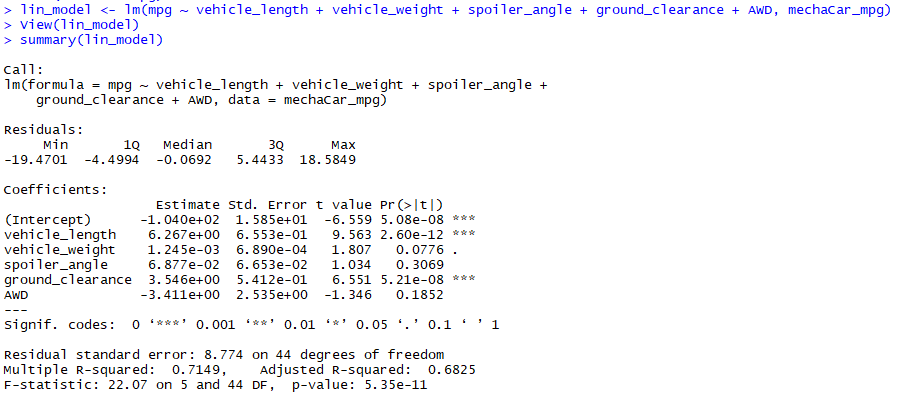

# MechaCar Study with R

# 1: Linear Regression to Predict MPG

The below linear regression analysis shows the predictions of MechaCar prototypes using vehicle length, vehicle weight, spoiler angle, ground clearance and AWD as variables.  The screen shot is shown below.  

 - The variables that had non-random amount of variance would be the vehicle_lenth and ground_clearance as shown by their P Values << 0.05 
 - The slope of the linear model is not zero as shown by the "Multiple R-squared" value of 0.7149 which indicates a correlation with the variables and mpg.  
 - The linear model somewhat predicts the mpg of MechaCar prototypes.  Our correlations show these factors (lenght & ground clearance mostly) play a role in determining the mpg but these are not the sole determing factors.  

# 2: Summary Statistics on Suspension Coils

The Total Summary figure shows the variance of 62.29 (below the 100 psi max limit) but in reviewing the breakout by lot we can see this is greatly influenced by lot 3 which has a variance of 170.29.   

Fig: Total Summary

Fig: Lot Summary

# 3: T-Test on Suspension Coils
T-Test Results for Lot 1  

T-Test Result for Lot 2 

T-Test Result for Lot 3 

## Study Design: MechaCar vs Competition

Another study to run would be to see how various factors impact highway vs city mpg.  
- Metrics that would be need tested would be the highway and city mpg for vehicles and the variances in different vehicles. 
    - Similar factors would be looked at to determine if individual factors imparct city vs highway mpg more. 
    - Factors: vehicle weight, vehicle lenght, ground clearance, average miles travled per month

- Null Hypothese: The factors that affect a vehicles mpg impact city & highway mpg the same.
- Alternative Hypothesis: Factors that impact a vehicles mpg have a higher statistical impact on city mpg than highway mpg. 

- Statistical Test to run to test the hypthesis.
    - similar test that we have used in this example, linear regressions, t-test and statistical summaries on city & highway mpg.

- Data needed to run the hypthesis
    - We would need the same data for our current test but would need to know when cars are on the highway vs in the city.  In a perfect test an identical car would drive soley in the city and the highway for each car tested to see how it would perform over the life of the car. 

